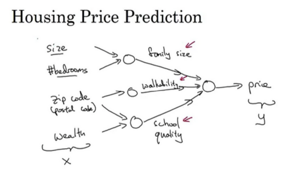
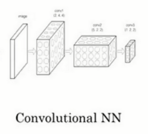

# Introduction

## 欢迎

在第一门课程中，你将学习如何建立神经网络（包含一个深度神经网络），以及如何在数据上面训练他们。在这门课程的结尾，你将用一个深度神经网络进行辨认猫。

在第二门课中，我们将使用三周时间。你将进行深度学习方面的实践，学习严密地构建神经网络，如何真正让它表现良好，因此你将要学习超参数调整、正则化、诊断偏差和方差以及一些高级优化算法，比如**Momentum**和**Adam**算法，犹如黑魔法一样根据你建立网络的方式。

在第三门课中，我们将使用两周时间来学习如何结构化你的机器学习工程。事实证明，构建机器学习系统的策略改变了深度学习的错误。

在第四门课程中，我们将会提到卷积神经网络(**CNN(s)**)，它经常被用于图像领域，你将会在第四门课程中学到如何搭建这样的模型。

第五门课中，你将会学习到序列模型，以及如何将它们应用于自然语言处理，以及其它问题。

序列模型包括的模型有循环神经网络（**RNN**）、全称是长短期记忆网络（**LSTM**）。你将在课程五中了解其中的时期是什么含义，并且有能力应用到自然语言处理（**NLP**）问题。

## 什么是神经网络？

让我们从一个房价预测的例子开始讲起。

  

神经网络的一部分神奇之处在于，当你实现它之后，你要做的只是输入$x$，就能得到输出$y$。因为它可以自己计算你训练集中样本的数目以及所有的中间过程。  

## 神经网络的监督学习

关于神经网络也有很多的种类，考虑到它们的使用效果，有些使用起来恰到好处，但事实表明，到目前几乎所有由神经网络创造的经济价值，本质上都离不开一种叫做监督学习的机器学习类别，让我们举例看看。

从历史经验上看，处理非结构化数据是很难的，与结构化数据比较，让计算机理解非结构化数据很难，而人类进化得非常善于理解音频信号和图像，文本是一个更近代的发明，但是人们真的很擅长解读非结构化数据。

## 为什么深度学习会兴起？

本节视频主要讲了推动深度学习变得如此热门的主要因素。包括数据规模、计算量及算法的创新。

我们通过改变算法，使得代码运行的更快，这也使得我们能够训练规模更大的神经网络，或者是多端口的网络。

